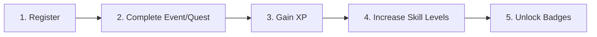

# Gamification Architecture & Mechanics

This skill outlines the mechanics, state transitions, calculation formulas, and validation rules governing the TechQuest gamification engine.

---

## 1. Gamification State Flow

Every user action progresses through a deterministic five-step lifecycle:



1. **Register**: User signs up for an active quest or tech event (added to `techquest_registrations`).
2. **Complete**: User finishes or submits proof/attendance for the event.
3. **Gain XP**: The event's base XP (and any bonus XP) is awarded to the user profile.
4. **Increase Skill Levels**: Skill categories tagged on the completed event (e.g., Frontend, AI, Cloud) increment based on XP gained.
5. **Unlock Badges**: Badge criteria are evaluated (e.g., "First Quest Completed", "Cloud Specialist", "Master Hacker"), and newly qualified badges are added to `techquest_profile.badges`.

---

## 2. Duplicate Completion Prevention

- **Strict Event Uniqueness**: An event ID can only be completed **once** per user account.
- Before awarding XP or triggering badge evaluation, check `techquest_completed_events`:
  ```javascript
  const completedList = getCompletedEvents();
  if (completedList.includes(eventId)) {
    throw new Error(`Event ${eventId} has already been completed.`);
  }
  ```
- If the event is already in `techquest_completed_events`, reject completion attempts, display an appropriate UI notification, and prevent duplicate XP awards.

---

## 3. Level & XP Formulas

- **User Level Formula**:
  $$\text{Level} = \lfloor \frac{\text{XP}}{500} \rfloor + 1$$

  ```javascript
  /**
   * Calculates user level from total accumulated XP
   * @param {number} xp - Total user XP
   * @returns {number} Level (1-indexed)
   */
  export function calculateLevel(xp) {
    const safeXp = Math.max(0, Number(xp) || 0);
    return Math.floor(safeXp / 500) + 1;
  }
  ```

- **XP Progress within Current Level**:
  ```javascript
  export function getLevelProgress(xp) {
    const safeXp = Math.max(0, Number(xp) || 0);
    const currentLevel = calculateLevel(safeXp);
    const xpInCurrentLevel = safeXp % 500;
    const progressPercent = Math.round((xpInCurrentLevel / 500) * 100);
    const xpToNextLevel = 500 - xpInCurrentLevel;

    return {
      currentLevel,
      xpInCurrentLevel,
      xpToNextLevel,
      progressPercent
    };
  }
  ```

---

## 4. Skill Tree & Badge Engine

### Skill Matrix Progression
- Each event contributes XP to associated skill tags (e.g., `javascript: +150`, `ai: +200`).
- Skill proficiency tiering:
  - **Novice**: 0 – 499 XP
  - **Practitioner**: 500 – 999 XP
  - **Specialist**: 1000 – 1999 XP
  - **Master**: 2000+ XP

### Badge Unlock Evaluation
- Run badge checks immediately following quest completion:
  ```javascript
  export function evaluateBadges(profile, completedEvents) {
    const newlyUnlocked = [];
    
    BADGE_DEFINITIONS.forEach((badge) => {
      if (!profile.badges.includes(badge.id) && badge.condition(profile, completedEvents)) {
        profile.badges.push(badge.id);
        newlyUnlocked.push(badge);
      }
    });

    return newlyUnlocked;
  }
  ```
